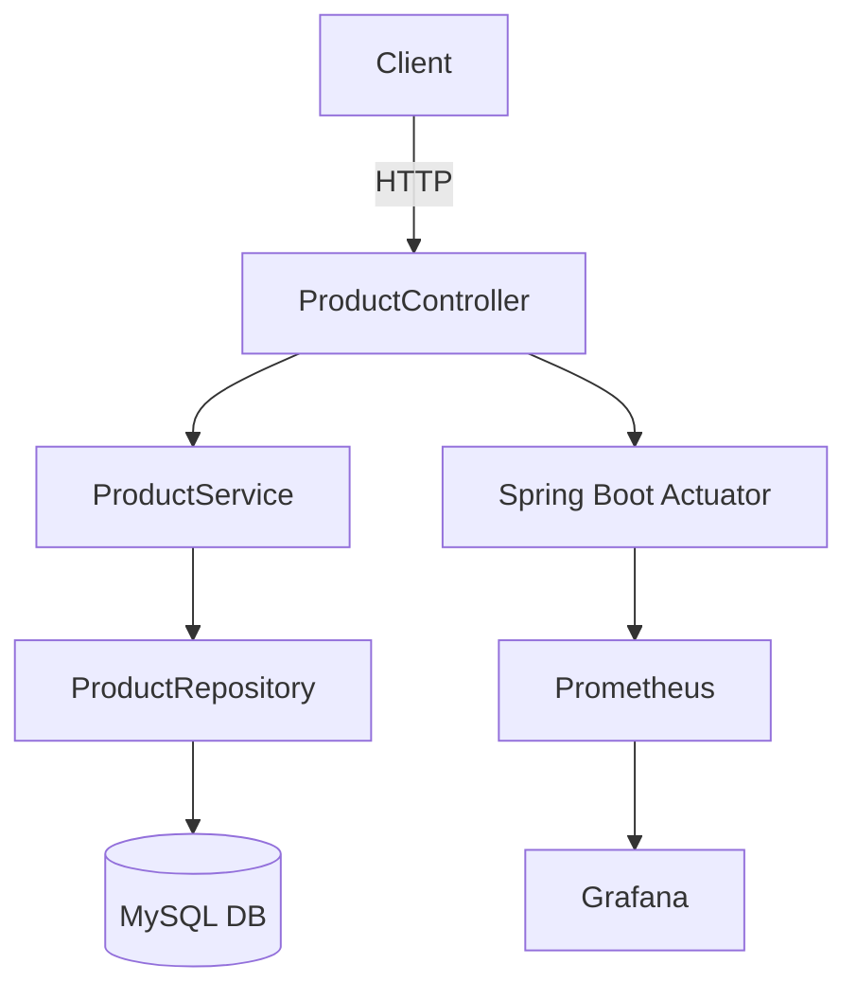
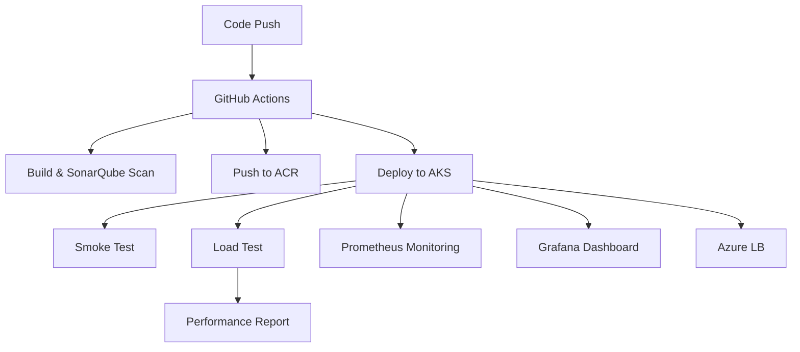

# Product Service Microservice

A Spring Boot microservice for managing products, featuring RESTful CRUD endpoints, MySQL integration, Docker/Kubernetes support, CI/CD with GitHub Actions, and observability with Prometheus and Grafana.

---

## Architecture



---

## Tech Stack
- Java 17
- Spring Boot 3
- Maven
- MySQL
- JPA/Hibernate
- Docker
- Kubernetes (AKS)
- GitHub Actions (CI/CD)
- SonarQube (Code Quality)
- Prometheus & Grafana (Monitoring)
- JUnit & Mockito (Testing)
- k6 (Load Testing)

---

## Features
- RESTful CRUD API for `Product` (id, name, price, quantity)
- Layered architecture: Controller, Service, Repository, DTO
- MySQL database integration
- Unit and integration tests
- Docker containerization
- Kubernetes manifests (Deployment, Service, Ingress, ConfigMap, Secret)
- CI/CD pipeline with test and e2e stages
- Monitoring endpoints and Grafana dashboard

---

## Getting Started

### Prerequisites
- Java 17
- Maven
- Docker
- MySQL (local or cloud)

### Local Development
1. **Configure DB**: Edit `src/main/resources/application.properties` with your MySQL settings. Example:
   ```properties
   spring.datasource.url=jdbc:mysql://localhost:3306/products
   spring.datasource.username=root
   spring.datasource.password=yourpassword
   spring.datasource.driver-class-name=com.mysql.cj.jdbc.Driver
   spring.jpa.hibernate.ddl-auto=update
   spring.jpa.database-platform=org.hibernate.dialect.MySQLDialect
   ```
2. **Build & Run**:
   ```bash
   mvn clean package
   java -jar target/hotel_service-0.0.1-SNAPSHOT.jar
   ```
3. **API Docs**: Visit [http://localhost:8080/api/products](http://localhost:8080/api/products)

### Docker
1. **Build Image**:
   ```bash
   docker build -t product-service:latest .
   ```
2. **Run Container**:
   ```bash
   docker run -e DB_HOST=host.docker.internal -e DB_USER=root -e DB_PASSWORD=yourpassword -e DB_NAME=products -e DB_PORT=3306 -p 8080:8080 product-service:latest
   ```

### Kubernetes
1. **Set up MySQL** (cloud or as a K8s service)
2. **Apply Manifests**:
   ```bash
   kubectl apply -f k8s/configmap.yaml
   kubectl apply -f k8s/secret.yaml
   kubectl apply -f k8s/deployment.yaml
   kubectl apply -f k8s/service.yaml
   kubectl apply -f k8s/ingress.yaml
   ```
3. **Access Service**: Use the LoadBalancer IP or Ingress host.

#### Environment Variables
- `DB_HOST`, `DB_PORT`, `DB_NAME`, `DB_USER`, `DB_PASSWORD` (for MySQL connection)

---

## Testing
- **Unit & Integration Tests**:
  ```bash
  mvn test
  ```
- **Load Test**:
  ```bash
  k6 run k8s/loadtest.js
  ```

---

## CI/CD Pipeline



- **Test Stage**: Build, test, SonarQube
- **E2E Stage**: Docker build/push, deploy to AKS, smoke/load test, monitoring

---

## Monitoring & Observability
- **Prometheus** scrapes `/actuator/prometheus`
- **Grafana** dashboard: see `monitoring/grafana-dashboard.json`

---

## Useful Commands
- Build: `mvn clean package`
- Run: `java -jar target/hotel_service-0.0.1-SNAPSHOT.jar`
- Docker build: `docker build -t product-service .`
- K8s deploy: `kubectl apply -f k8s/`
- Test: `mvn test`

---

## Folder Structure
- `src/main/java/com/example/product/` — Source code
- `src/test/java/com/example/product/` — Tests
- `k8s/` — Kubernetes manifests
- `monitoring/` — Grafana dashboards
- `.github/workflows/` — CI/CD pipeline

---

## License
MIT (or specify your license) 